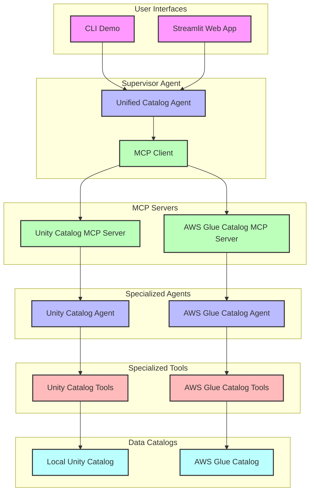
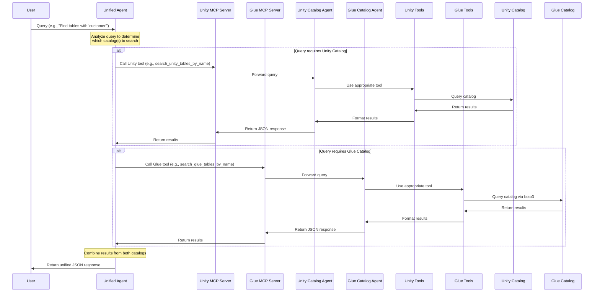

# Architecture Diagrams for Multi-Agent Catalog System

This document provides architecture diagrams showing how the agents work together and interact with the data catalogs in the multi-agent catalog system.

## System Architecture Overview

The system follows a hierarchical multi-agent architecture with three main agents:
1. **Unity Catalog Agent** - Specialized for querying the Unity catalog
2. **AWS Glue Catalog Agent** - Specialized for querying the AWS Glue catalog
3. **Unified Catalog Agent** - Supervisor agent that coordinates between the specialized agents

These agents are integrated using the Model Context Protocol (MCP), which allows the supervisor agent to use the specialized agents as tools.

## Data Flow Sequence

The following diagram illustrates the data flow when a user makes a query:

## Key Components

### 1. User Interfaces
- **CLI Demo (demo.py)**: Command-line interface for testing agents
- **Streamlit Web App (streamlit_demo.py)**: Web interface for the unified agent

### 2. Unified Catalog Agent
- Acts as a supervisor agent
- Uses MCP clients to communicate with specialized agents
- Determines which catalog(s) to query based on user input
- Combines results from both catalogs into a unified response

### 3. MCP Servers
- **Unity Catalog MCP Server**: Wraps the Unity catalog agent as an MCP tool
- **AWS Glue Catalog MCP Server**: Wraps the AWS Glue catalog agent as an MCP tool
- Both servers expose their respective agents' functionality through a standardized interface

### 4. Specialized Agents
- **Unity Catalog Agent**: Specialized for querying the Unity catalog
- **AWS Glue Catalog Agent**: Specialized for querying the AWS Glue catalog
- Both use Claude 3.7 Sonnet model and have specialized tools

### 5. Specialized Tools
- **Unity Catalog Tools**: Tools for interacting with the Unity catalog
- **AWS Glue Catalog Tools**: Tools for interacting with the AWS Glue catalog
- Both sets of tools provide similar functionality but are adapted to their respective catalogs

### 6. Data Catalogs
- **Local Unity Catalog**: A mock implementation of the Databricks Unity catalog
- **AWS Glue Catalog**: The actual AWS Glue catalog accessed via boto3

## Technology Stack

- **AWS Strands SDK**: Framework for building AI agents
- **Amazon Bedrock**: Managed service providing access to foundation models (Claude 3.7 Sonnet)
- **Model Context Protocol (MCP)**: Protocol for wrapping agents as tools
- **Python**: Primary programming language for implementation
- **boto3**: AWS SDK for Python, used for interacting with AWS services
- **Streamlit**: Web application framework for the demo interface

## Key Differences Between Catalogs

- **Unity Catalog**: Uses a three-level namespace (catalog_name.schema_name.table_name)
- **AWS Glue Catalog**: Uses a two-level namespace (database_name.table_name)

This architecture demonstrates how multiple specialized agents can be combined using MCP to create a unified interface for data discovery across different platforms.
