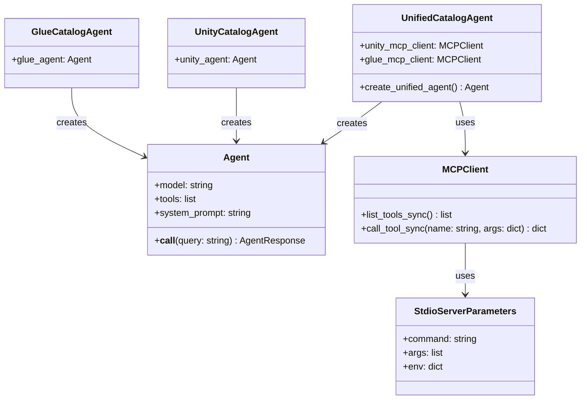
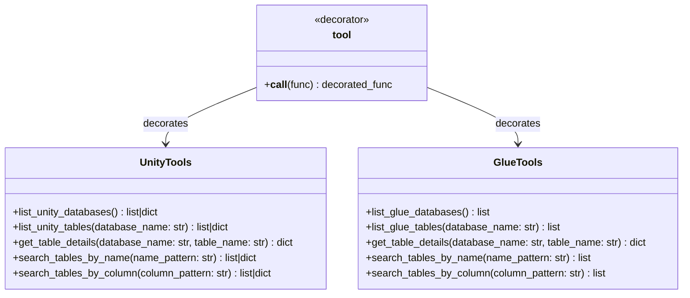
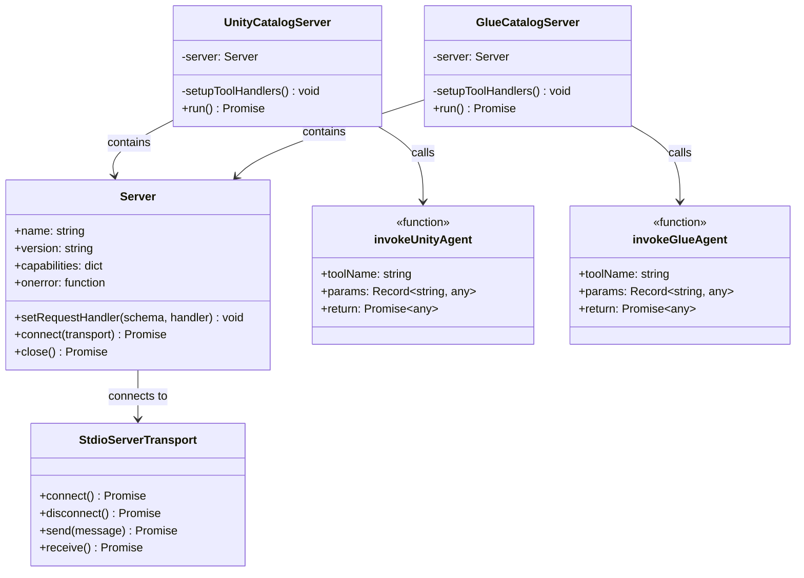
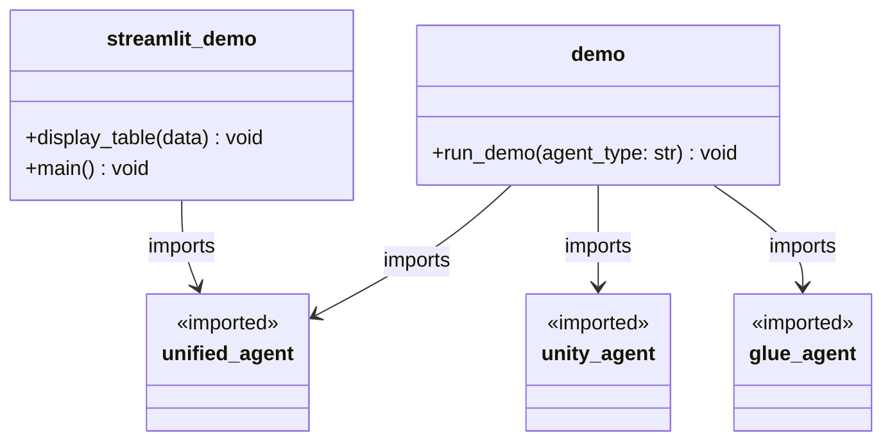

# Implementation Details

This document provides detailed information about the implementation of the multi-agent catalog system, focusing on the code structure, classes, and interfaces.

## Agent Implementation Structure



## Tool Implementation Structure



## MCP Server Implementation



## Demo Application Structure



## Code Snippets

### Agent Creation

```python
# Creating the Unity catalog agent
unity_agent = Agent(
    model="us.anthropic.claude-3-7-sonnet-20250219-v1:0",
    tools=[
        list_unity_databases,
        list_unity_tables,
        get_table_details,
        search_tables_by_name,
        search_tables_by_column
    ],
    system_prompt="You are a Unity catalog assistant..."
)

# Creating the AWS Glue catalog agent
glue_agent = Agent(
    model="us.anthropic.claude-3-7-sonnet-20250219-v1:0",
    tools=[
        list_glue_databases,
        list_glue_tables,
        get_table_details,
        search_tables_by_name,
        search_tables_by_column
    ],
    system_prompt="You are an AWS Glue catalog assistant..."
)

# Creating the unified catalog agent
def create_unified_agent():
    # Connect to the MCP servers and get their tools
    with unity_mcp_client, glue_mcp_client:
        unity_tools = unity_mcp_client.list_tools_sync()
        glue_tools = glue_mcp_client.list_tools_sync()
        
        # Combine all tools
        all_tools = unity_tools + glue_tools
        
        # Create the agent with all tools
        unified_agent = Agent(
            model="us.anthropic.claude-3-7-sonnet-20250219-v1:0",
            tools=all_tools,
            system_prompt="You are a unified catalog assistant..."
        )
        
        return unified_agent
```

### Tool Implementation

```python
# Unity catalog tool example
@tool
def list_unity_databases() -> list | dict:
    """
    List all schemas (databases) in the Unity catalog
    
    Returns:
        list: A list of schema (database) names
        dict: Error information if the Unity catalog service is unavailable
    """
    try:
        # First, get all catalogs
        try:
            catalogs_response = requests.get(f"{BASE_URL}/catalogs", timeout=10)
            catalogs_response.raise_for_status()
        except requests.exceptions.RequestException as e:
            return {
                "error": "unity_catalog_unavailable",
                "error_message": f"Failed to connect to Unity catalog service: {str(e)}",
                "suggestion": "Please ensure the Unity catalog service is running at " + BASE_URL
            }
            
        catalogs_data = catalogs_response.json()
        
        # Then, get schemas for each catalog
        all_schemas = []
        for catalog in catalogs_data.get("catalogs", []):
            catalog_name = catalog.get("name")
            try:
                schemas_response = requests.get(f"{BASE_URL}/schemas?catalog_name={catalog_name}", timeout=10)
                schemas_response.raise_for_status()
                schemas_data = schemas_response.json()
                
                # Add schemas with their catalog prefix
                for schema in schemas_data.get("schemas", []):
                    schema_name = schema.get("name")
                    all_schemas.append(f"{catalog_name}.{schema_name}")
            except requests.exceptions.RequestException as e:
                return {
                    "error": "unity_catalog_unavailable",
                    "error_message": f"Failed to get schemas for catalog {catalog_name}: {str(e)}",
                    "suggestion": "Please ensure the Unity catalog service is running correctly"
                }
        
        return all_schemas
    except Exception as e:
        return {
            "error": "unity_catalog_error",
            "error_message": f"Unexpected error when accessing Unity catalog: {str(e)}",
            "suggestion": "Please check the Unity catalog service configuration"
        }

# Glue catalog tool example
@tool
def list_glue_databases() -> list:
    """
    List all databases in the AWS Glue catalog
    
    Returns:
        list: A list of database names
    """
    glue_client = boto3.client('glue')
    response = glue_client.get_databases()
    return [db['Name'] for db in response['DatabaseList']]
```

### MCP Server Implementation

```typescript
// MCP server setup
this.server.setRequestHandler(ListToolsRequestSchema, async () => ({
  tools: [
    {
      name: 'list_unity_databases',
      description: 'List all databases in the Unity catalog',
      inputSchema: {
        type: 'object',
        properties: {},
        required: [],
      },
    },
    // Other tools...
  ],
}));

this.server.setRequestHandler(CallToolRequestSchema, async (request) => {
  const toolName = request.params.name;
  const args = request.params.arguments as Record<string, any>;
  
  try {
    const result = await invokeUnityAgent(toolName, args);
    
    // Check if there was an error in the result
    if (result.error) {
      return {
        content: [
          {
            type: 'text',
            text: `Error: ${result.message || result.error}`,
          },
        ],
        isError: true,
      };
    }
    
    return {
      content: [
        {
          type: 'text',
          text: JSON.stringify(result, null, 2),
        },
      ],
    };
  } catch (error) {
    console.error(`Error calling Unity catalog agent:`, error);
    return {
      content: [
        {
          type: 'text',
          text: `Failed to call Unity catalog agent: ${error instanceof Error ? error.message : String(error)}`,
        },
      ],
      isError: true,
    };
  }
});
```

### Demo Implementation

```python
def run_demo(agent_type="unity"):
    """Run a demonstration of the selected catalog agent
    
    Args:
        agent_type: Type of agent to use ('glue', 'unity', or 'unified')
    """
    if agent_type.lower() == "glue":
        print("AWS Glue Catalog Agent Demo")
        print("===========================")
        agent = glue_agent
    elif agent_type.lower() == "unified":
        print("Unified Catalog Agent Demo")
        print("==========================")
        agent = unified_agent
    else:  # Default to unity
        print("Unity Catalog Agent Demo")
        print("=======================")
        agent = unity_agent
    
    print("Type 'exit' to quit the demo")
    
    while True:
        query = input("\nEnter your query: ")
        if query.lower() == 'exit':
            break
            
        print("\nProcessing query...")
        try:
            response = agent(query)
            print("\nAgent Response:")
            
            # Pretty print the JSON response
            try:
                # Convert response.message to string before parsing as JSON
                response_str = str(response.message)
                response_json = json.loads(response_str)
                print(json.dumps(response_json, indent=2))
            except json.JSONDecodeError:
                # If the response is not valid JSON, print it as is
                print(response.message)
                
        except Exception as e:
            print(f"Error: {e}")
```

## Key Implementation Patterns

1. **Agent Specialization**:
   - Each agent is specialized for a specific catalog
   - Agents use the same model but have different tools and system prompts

2. **Tool Consistency**:
   - Both Unity and Glue tools provide similar functionality
   - Tools follow a consistent naming pattern and return format
   - Error handling is consistent across tools

3. **MCP Integration**:
   - MCP servers wrap specialized agents as tools
   - MCP clients in the unified agent connect to these servers
   - Tool schemas define the interface between agents

4. **Response Formatting**:
   - All agents return responses in a consistent JSON format
   - The unified agent combines responses from both catalogs
   - Error handling is consistent across all agents

5. **Demo Interfaces**:
   - CLI demo provides a simple interface for testing
   - Streamlit demo provides a web interface with more features
   - Both demos use the same agent instances

These implementation details show how the multi-agent system is structured and how the different components interact with each other.
