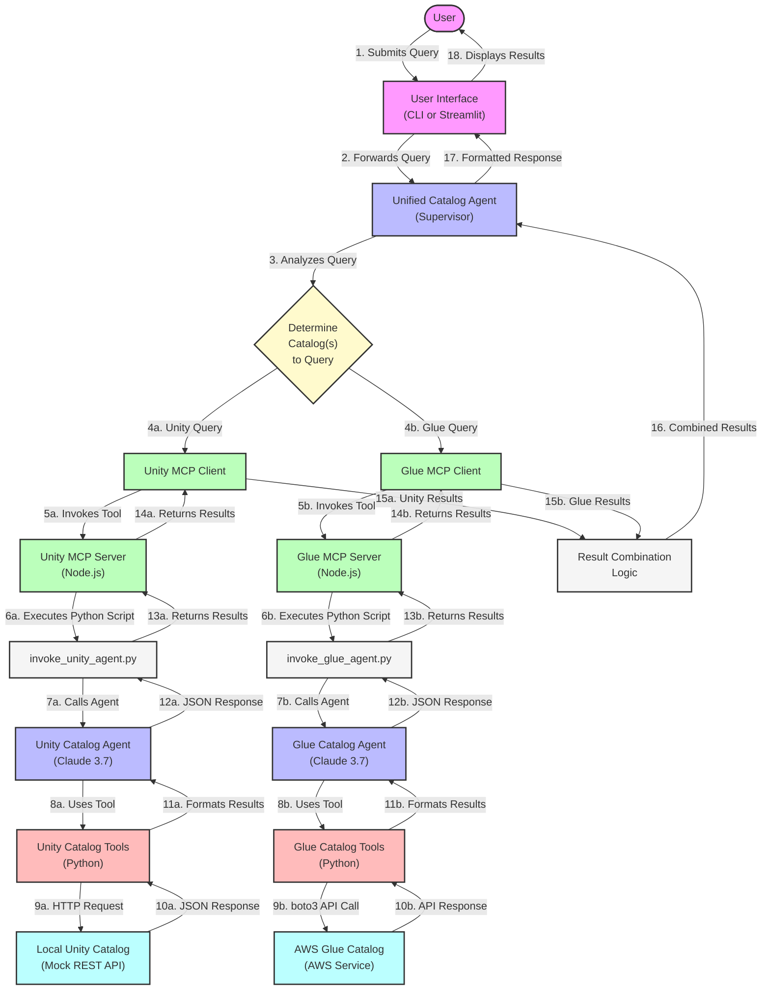
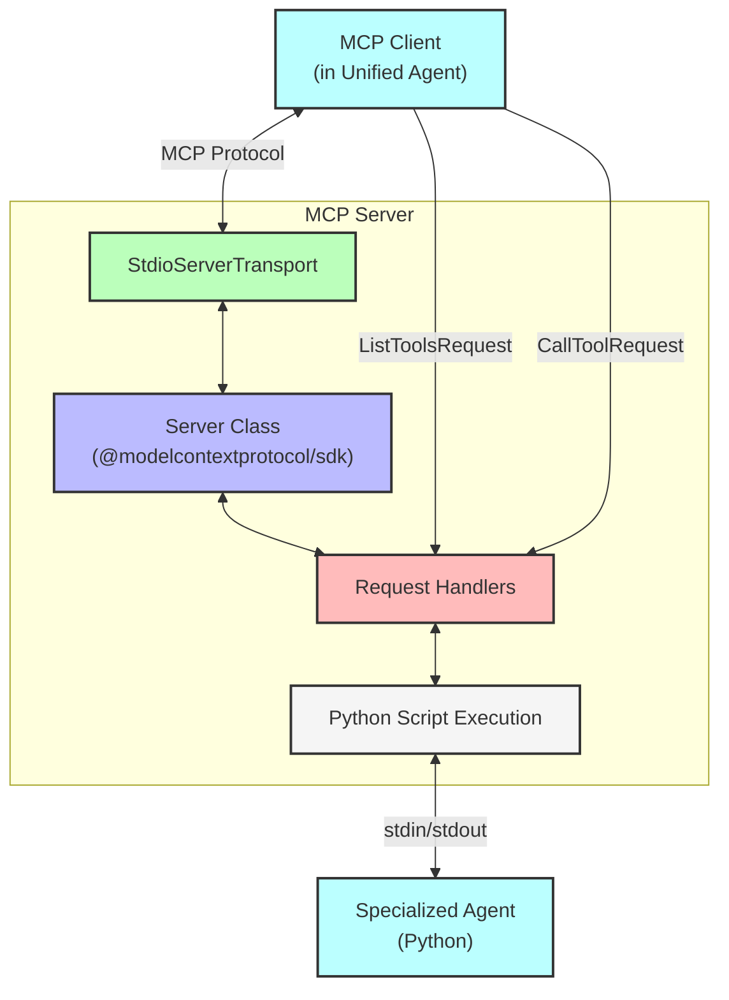
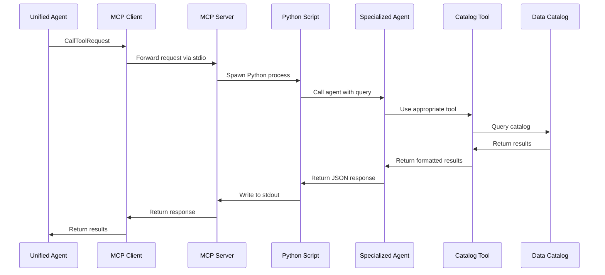

# Technical Data Flow Diagrams

This document provides detailed technical diagrams showing the data flow between components in the multi-agent catalog system.

## Component Interaction Flow

The following diagram shows the detailed interaction between all components in the system:



## Data Structure Flow

This diagram illustrates how data is transformed as it flows through the system:

```mermaid
flowchart LR
    %% Input
    UserQuery["User Query\n(Natural Language)"] --> UA["Unified Agent"]
    
    %% Processing in Unified Agent
    UA --> |"Analyze"| Intent["Query Intent\n- Target catalog(s)\n- Operation type\n- Search parameters"]
    Intent --> |"Transform to"| MCPCalls["MCP Tool Calls\n- Tool name\n- Parameters"]
    
    %% MCP Server Processing
    MCPCalls --> |"Unity MCP"| UAgentQuery["Unity Agent Query\n(Natural Language)"]
    MCPCalls --> |"Glue MCP"| GAgentQuery["Glue Agent Query\n(Natural Language)"]
    
    %% Specialized Agent Processing
    UAgentQuery --> UToolCall["Unity Tool Call\n- Function name\n- Parameters"]
    GAgentQuery --> GToolCall["Glue Tool Call\n- Function name\n- Parameters"]
    
    %% Catalog Queries
    UToolCall --> URequest["Unity HTTP Request\n- Endpoint\n- Query parameters"]
    GToolCall --> GRequest["Glue boto3 Call\n- Service\n- Method\n- Parameters"]
    
    %% Results
    URequest --> UResponse["Unity Response\n(JSON)"]
    GRequest --> GResponse["Glue Response\n(JSON)"]
    
    %% Result Processing
    UResponse --> UAgentResponse["Unity Agent Response\n(Formatted JSON)"]
    GResponse --> GAgentResponse["Glue Agent Response\n(Formatted JSON)"]
    
    %% Result Combination
    UAgentResponse --> Combined["Combined Results\n(Unified JSON)"]
    GAgentResponse --> Combined
    
    %% Final Response
    Combined --> FinalResponse["Final Response to User\n(Formatted JSON with summary)"]
    
    %% Styling
    classDef input fill:#f9f,stroke:#333,stroke-width:2px;
    classDef agent fill:#bbf,stroke:#333,stroke-width:2px;
    classDef process fill:#f5f5f5,stroke:#333,stroke-width:2px;
    classDef request fill:#fbb,stroke:#333,stroke-width:2px;
    classDef response fill:#bff,stroke:#333,stroke-width:2px;
    classDef output fill:#bfb,stroke:#333,stroke-width:2px;
    
    class UserQuery input;
    class UA,UAgentQuery,GAgentQuery agent;
    class Intent,MCPCalls,UToolCall,GToolCall process;
    class URequest,GRequest request;
    class UResponse,GResponse,UAgentResponse,GAgentResponse response;
    class Combined,FinalResponse output;
```



## JSON Response Format

The unified agent returns responses in a standardized JSON format:

```json
{
  "query": "The user's original query",
  "unity_results": [
    {
      "database": "catalog_name.schema_name",
      "table": "table_name",
      "matching_columns": ["column1", "column2"]
    }
  ],
  "glue_results": [
    {
      "database": "database_name",
      "table": "table_name",
      "matching_columns": ["column1", "column2"]
    }
  ],
  "summary": "A brief natural language summary of what was found across both catalogs"
}
```

## MCP Server Architecture

The MCP servers act as bridges between the unified agent and the specialized agents:



## Tool Execution Flow

This diagram shows the detailed flow of a tool execution:



These diagrams provide a comprehensive view of how data flows through the multi-agent catalog system, from the user's query to the final response.
